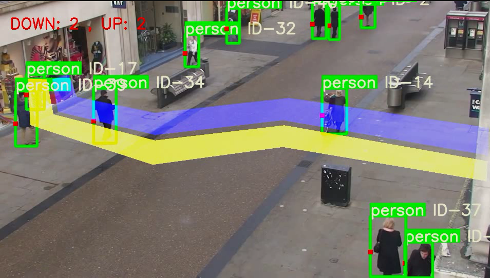

@[toc]

# 1、前言

> 1、本文基于YOLOv5+DeepSort的行人车辆的检测，跟踪和计数。
>
> 2、该项目是基于github的[黄老师傅](https://github.com/dyh/unbox_yolov5_deepsort_counting)，黄老师傅的项目输入视频后，直接当场利用cv2.imshow()，查看识别的结果， 无法当场保存检测完视频，而且无法在服务器上跑，本文实现保存视频的结果已经命令行修改视频。

# 源项目实现功能

1. 实现了 出/入 分别计数。
2. 显示检测类别。
3. 默认是 南/北 方向检测，若要检测不同位置和方向，可在 main.py 文件第13行和21行，修改2个polygon的点。
4. 默认检测类别：行人、自行车、小汽车、摩托车、公交车、卡车。
5. 检测类别可在 detector.py 文件第60行修改。

> **本项目实现功能**

1. **保存识别视频**
2. **提供命令行修改视频**


# 运行环境

1. python 3.6+，pip 20+
2. pip install -r requirements.txt

# 如何运行

1. 下载代码

   ```
   $ git clone https://github.com/wisdom-zhe/yolov5-deepsort-counting.git
   ```

   > 因此repo包含weights及mp4等文件，若 git clone 速度慢，可直接下载zip文件：https://github.com/dyh/unbox_yolov5_deepsort_counting/archive/main.zip

2. 进入目录

   ```
   $ cd yolov5-deepsort-counting
   ```

3. 创建 python 虚拟环境

   ```
   $ python3 -m venv venv
   ```

4. 激活虚拟环境

   ```
   $ source venv/bin/activate
   ```

5. 升级pip

   ```
   $ python -m pip install --upgrade pip
   ```

6. 安装pytorch

   > 根据你的操作系统、安装工具以及CUDA版本，在 https://pytorch.org/get-started/locally/ 找到对应的安装命令。我的环境是 ubuntu 18.04.5、pip、CUDA 11.0。

   ```
   $ pip install torch==1.7.1+cu110 torchvision==0.8.2+cu110 torchaudio===0.7.2 -f https://download.pytorch.org/whl/torch_stable.html
   ```

7. 安装软件包

   ```
   $ pip install -r requirements.txt
   ```

8. 在 main.py 文件中第66行，设置要检测的视频文件路径，默认为 './video/test.mp4'

   > 140MB的测试视频可以在这里下载：https://pan.baidu.com/s/1qHNGGpX1QD6zHyNTqWvg1w 提取码: 8ufq

   ```
   capture = cv2.VideoCapture('./video/test.mp4')
   ```

9. 运行程序

   ```
   python detect-car.py
   ```


# 运行结果



# 使用框架

- https://github.com/Sharpiless/Yolov5-deepsort-inference
- https://github.com/ultralytics/yolov5/
- https://github.com/ZQPei/deep_sort_pytorch